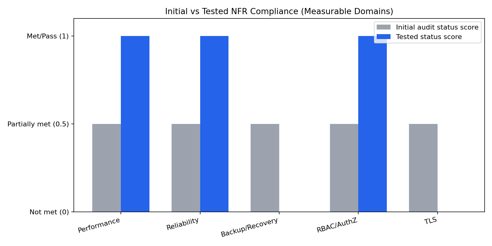

# Measurable NFR Requirements Summary

Date: 2026-05-07  
Scope: Formal summary of measurable non-functional requirements (NFRs) using current repository evidence artifacts.

## 1) Measurable Requirements Register

| Domain | Requirement (Measurable) | Target / Acceptance Criteria | Initial Audit Status | Latest Tested Result | Status |
| --- | --- | --- | --- | --- | --- |
| Performance | `patient_record` latency under load | p80 <= 5000 ms at 300 VU | Partially Met | 4675.27 ms (`patient_record_p80_300vu`) | Pass |
| Performance | `appointment_write` latency under load | p75 <= 7000 ms at 300 VU | Partially Met | 5246.03 ms (`appointment_write_p75_300vu`) | Pass |
| Performance | Appointment write sample sufficiency | `appointment_write_samples >= 100` | Partially Met | 2293 samples | Pass |
| Performance | Request failure rate | `http_req_failed < 1%` | Partially Met | 0.00% | Pass |
| Reliability | Recovery under controlled fault | Health returns to 200 after backend stop/start; MTTR captured | Partially Met | MTTR 25s; health `200 -> ERR -> 200` | Pass |
| Backup/Recovery | Backup-restore drill completeness | Drill completes with valid backup + restore verification | Partially Met | Drill evidence `pass=false` (`DB_USER` missing) | Fail |
| Security (RBAC/AuthZ) | Authorization enforcement tests | Explicit allow/deny coverage via automated tests | Partially Met | RBAC tests pass (9/9) | Pass |
| Security (TLS) | HTTPS-only posture | HTTPS reachable; HTTP blocked/redirected | Partially Met | `httpsStatus=-1`, `httpStatus=200` | Fail |

## 2) Comparison Figure (Initial vs Tested)

Figure file: `docs/nfr/figures/initial-vs-tested-nfr-comparison.png`

## 3) Figure Methodology

- The figure compares measurable domains on a normalized score:
  - `0.0` = Not met / fail
  - `0.5` = Partially met
  - `1.0` = Met / pass
- **Initial score** is taken from the NFR audit baseline status (all listed measurable domains were `Partially Met`).
- **Tested score** is mapped from latest evidence artifacts:
  - Performance: `k6/out/nfr-validated-report.json`
  - Reliability: `docs/operations/evidence/20260506-130523-local/reliability-drill.json`
  - Backup/Recovery: `docs/operations/evidence/20260506-130523-local/backup-restore-drill.json`
  - RBAC/AuthZ: `docs/operations/evidence/20260506-130523-local/nfr-runner-summary.json` + backend tests
  - TLS: `docs/operations/evidence/20260506-010202-local/tls-verification.json`

## 4) Executive Snapshot

- Measurable requirements passed: **6/8 (75%)**
- Measurable requirements failed: **2/8 (25%)**
- Highest remaining closure risk: **Backup/Recovery drill robustness** and **TLS enforcement evidence**
